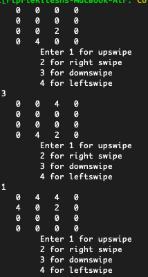
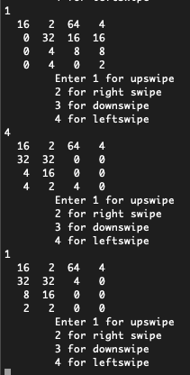

## 2048

[2048](https://play.google.com/store/apps/details?id=com.androbaby.original2048&hl=en_IN&gl=US) is a single player game which emerged as one of the most addictive games of it's time. It is simple but entertaining basic math based game which prompted me to try and code it out. I implemented the basic logic and made a console game where user can play by giving the input which direction he wants to swipe. Its an exact working solution of that game just the UI and User control is inferior as it had to run on terminal and I had no knowledge of APP UI. Now lets see what it is.

### Instructions

Compile and run using this command

```bash
 $ gcc 2048.c
 $ ./a.out
 ```
This game is written in C. I wish to make this as an App with a few UX tweaks to be able to play with dynamic grid size.

### How to Play

1. Its a single player game with square grid play ground (typically `4*4`) with initial state ther are 3 numbers (either 2 or 4) are present in 3 random location.

  

2. User swipes in one direction (right, left, up or down) making all the cells with numbers move towards that direction based on two rules (As mine is console based it takes integer input defining each direction).
  A. The empty cells falling in the movement path is skipped.
  B. After applying rule A the adjacent same valued cells (based on the direction i.e. if two 2s are side by side horizontally and user selects left or right swipe then they are added and occupies left or right block respectively) are merged. The value of the cell is doubled.
  
3. In each swipe a new number (either 2 or 4) is added to the board in a random location empty cell.

4. When there is no empty space left to add new block after a swipe then its game over

5. Goal is to have the highest possible value in any one cell. When any cell reaches 2048 value then player wins the game.

### Future plan

1. I hope to update this as a xamarin app and update the UX
2. Add dynamic grid size
3. Add the undo feature

Feel free to suggest any imporvemet or new feature, I will try to add.
